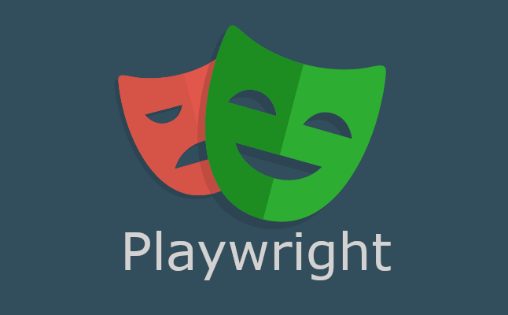
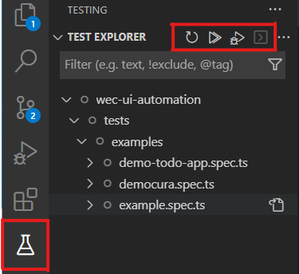

<a name="readme-top"></a>

<!-- PROJECT LOGO -->
<br />
<div align="center">


  <br>
  <h3 align="center">Demo Playwright UI Automation</h3>

  <br>
  <p align="center">
    An reliable end-to-end testing for modern web apps!
    <br />
    <a href="https://playwright.dev/"><strong>Explore the docs »</strong></a>
    <br />
  </p>
</div>
<br>

<!-- TABLE OF CONTENTS -->
<details>
  <summary>Table of Contents</summary>
  <ol>
    <li>
      <a href="#about-the-project">About The Project</a>
    </li>
    <li>
      <a href="#getting-started">Getting Started</a>
      <ul>
        <li><a href="#prerequisites">Prerequisites</a></li>
        <li><a href="#installation">Installation</a></li>
      </ul>
    </li>
    <li>
      <a href="#run-tests">How to run tests</a>
      <ul>
        <li><a href="#run-with-plugin">Run tests with plugin</a></li>
        <li><a href="#run-with-commandline">Run tests with commandline</a></li>
      </ul>
    </li>
  </ol>
</details>
<br>

<!-- ABOUT THE PROJECT -->
## About The Project
This project is created to demo on automation UI testing using Playwright framework

<p align="right">(<a href="#readme-top">back to top</a>)</p>

<!-- GETTING STARTED -->
## Getting Started

This is an example of how you may give instructions on setting up your project locally.
To get a local copy up and running follow these simple example steps.

### Prerequisites

This is an example of how to list things you need to use the software.

* [Node.js and NPM](https://docs.npmjs.com/downloading-and-installing-node-js-and-npm)

* [Visual Studio Code](https://code.visualstudio.com/download)

* VSCode plugins:
  - [Playwright Test for VSCode](https://marketplace.visualstudio.com/items?itemName=ms-playwright.playwright)

### Installation

At the project's directory:

1. Install NPM modules
   ```sh
   npm install
   ```
2. Install playwright
   ```sh
   npx playwright install
   ```

<p align="right">(<a href="#readme-top">back to top</a>)</p>

<br>

<!-- Run tests -->
## Run Tests
Here are instructions to run tests on your local machine
<br>

### Run with plugin
Playwright Test for VSCode



<br>

### Run with commandline
First change your working directory to the playwright project.
Then you can run several commands:

```sh
npx playwright test
```
» Runs all the tests
<br>
<br>

```sh
npx playwright test --project=chromium
```
» Runs the tests only on Desktop Chrome
<br>
<br>

```sh
npx playwright test democura
```
» Runs the tests in a specific file named *democura.spec.ts*
<br>
<br>

```sh
npx playwright test --debug
```
» Runs the tests in debug mode
<br>
<br>

```sh
npx playwright codegen
```
» Auto generte tests with codegen
<br>
<br>


<p align="right">(<a href="#readme-top">back to top</a>)</p>
